# 🌊 BrunoX Chat - Blockchain-Powered Messaging Platform

<div align="center">


**A cutting-edge decentralized messaging application that combines real-time chat with Ethereum blockchain verification**

[](https://reactjs.org/)
[](https://www.typescriptlang.org/)
[](https://supabase.com/)
[](https://ethereum.org/)

</div>

---

## 📖 Table of Contents

- [Overview](#-overview)
- [Features](#-features)
- [Architecture](#-architecture)
- [Prerequisites](#-prerequisites)
- [Installation](#-installation)
- [Configuration](#-configuration)
- [Usage Guide](#-usage-guide)
- [Blockchain Integration](#-blockchain-integration)
- [Smart Contract Details](#-smart-contract-details)
- [Troubleshooting](#-troubleshooting)
- [Development](#-development)
- [Contributing](#-contributing)

---

## 🌟 Overview

BrunoX Chat is a modern, decentralized messaging platform that brings the power of blockchain technology to everyday communications. Unlike traditional messaging apps, every message you send can be cryptographically verified and stored on the Ethereum blockchain, ensuring maximum security, transparency, and immutability.

### Why BrunoX Chat?

- **🔐 Cryptographic Security**: Messages are hashed and stored on the blockchain
- **✅ Verifiable Authenticity**: Prove message integrity through blockchain verification
- **🚀 Real-time Performance**: Instant messaging with modern UI/UX
- **💎 Web3 Ready**: Full MetaMask integration for wallet connectivity
- **🌐 Decentralized Storage**: Option to store messages on IPFS
- **🎨 Beautiful Design**: Modern, responsive interface with dark/light themes

---

## ✨ Features

### Core Messaging
- 💬 **Real-time Chat**: Instant messaging with WebSocket connections
- 👥 **Friend System**: Add friends, manage friend requests, search users
- 📱 **Responsive Design**: Seamless experience on desktop and mobile
- 🎨 **Theme Support**: Switch between light and dark modes

### Blockchain Features
- ⛓️ **Blockchain Verification**: Every message gets a unique blockchain hash
- 🔗 **Smart Contract Integration**: Automated message verification via Solidity contracts
- 🦊 **MetaMask Support**: Connect your Web3 wallet for enhanced security
- 📊 **Transaction Tracking**: Monitor gas usage and transaction fees
- 🏷️ **Message Status Indicators**: Visual badges showing blockchain verification status

### Security & Privacy
- 🔒 **Supabase Authentication**: Secure user authentication and session management
- 🛡️ **Row Level Security (RLS)**: Database-level access control
- 🔑 **Wallet Signatures**: Cryptographic message signing with private keys
- 📝 **Audit Trail**: Immutable record of all blockchain-verified messages

---

## 🏗 Architecture

```
┌─────────────────────────────────────────────────────────┐
│                    Frontend (React)                     │
│  ┌──────────────┐  ┌──────────────┐  ┌──────────────┐ │
│  │   UI Layer   │  │  State Mgmt  │  │   Routing    │ │
│  │ (shadcn/ui)  │  │   (Context)  │  │ (React Router)│ │
│  └──────────────┘  └──────────────┘  └──────────────┘ │
└─────────────────────────────────────────────────────────┘
                          ↕
┌─────────────────────────────────────────────────────────┐
│              Backend Services (Supabase)                │
│  ┌──────────────┐  ┌──────────────┐  ┌──────────────┐ │
│  │  PostgreSQL  │  │     Auth     │  │ Edge Functions││
│  │   Database   │  │   Service    │  │ (Deno Runtime)││
│  └──────────────┘  └──────────────┘  └──────────────┘ │
└─────────────────────────────────────────────────────────┘
                          ↕
┌─────────────────────────────────────────────────────────┐
│         Blockchain Layer (Ethereum/Ganache)             │
│  ┌──────────────┐  ┌──────────────┐  ┌──────────────┐ │
│  │Smart Contract│  │   Ethers.js  │  │   MetaMask   │ │
│  │   (Solidity) │  │   Provider   │  │   Wallet     │ │
│  └──────────────┘  └──────────────┘  └──────────────┘ │
└─────────────────────────────────────────────────────────┘
```

---

## 📋 Prerequisites

### Required Software

| Software | Version | Purpose | Download Link |
|----------|---------|---------|---------------|
| **Node.js** | v18+ | JavaScript runtime | [nodejs.org](https://nodejs.org/) |
| **npm/yarn** | Latest | Package manager | Included with Node.js |
| **Git** | Latest | Version control | [git-scm.com](https://git-scm.com/) |
| **MetaMask** | Latest | Web3 wallet | [metamask.io](https://metamask.io/) |
| **Ganache** | v7.9+ | Local blockchain | [trufflesuite.com/ganache](https://trufflesuite.com/ganache/) |

### Recommended
- Modern browser (Chrome, Firefox, Brave, Edge)
- Basic understanding of blockchain concepts
- Familiarity with React and TypeScript (for development)

---

## 🚀 Installation

### Step 1: Clone the Repository

```bash
git clone https://github.com/yourusername/brunox-chat.git
cd brunox-chat
```

### Step 2: Install Dependencies

```bash
npm install
# or
yarn install
```

This will install all required packages including:
- React ecosystem (react, react-dom, react-router-dom)
- TypeScript and build tools
- UI components (shadcn/ui, Radix UI)
- Blockchain libraries (ethers.js, web3, ganache)
- Supabase client and utilities

### Step 3: Environment Configuration

The `.env` file is already configured with Supabase credentials. If you need to modify it:

```env
VITE_SUPABASE_URL=https://onkmssciuonxlticpiey.supabase.co
VITE_SUPABASE_ANON_KEY=eyJhbGciOiJIUzI1NiIsInR5cCI6IkpXVCJ9...
```

---

## ⚙️ Configuration

### 🔗 Blockchain Setup

#### Option A: Ganache GUI (Recommended for Beginners)

1. **Download and Install**
   ```
   Visit: https://trufflesuite.com/ganache/
   Download the appropriate version for your OS
   ```

2. **Launch Ganache**
   - Open the Ganache application
   - Click "Quickstart" or "New Workspace"

3. **Configure Network Settings**
   ```
   Server: HTTP://127.0.0.1
   Port: 7545
   Network ID: 1337
   Automine: Enabled
   Gas Limit: 6721975
   Gas Price: 20000000000
   ```

4. **Account Setup**
   - Ganache will automatically create 10 accounts
   - Each account starts with 100 ETH
   - Note down the first account's private key (click the key icon 🔑)

#### Option B: Ganache CLI (For Advanced Users)

```bash
# Install Ganache CLI globally
npm install -g ganache

# Start Ganache with optimal settings
ganache \
  --port 7545 \
  --networkId 1337 \
  --accounts 10 \
  --defaultBalanceEther 100 \
  --gasLimit 6721975 \
  --gasPrice 20000000000 \
  --mnemonic "your custom mnemonic here"
```

**Pro Tips:**
- Use `--deterministic` flag for consistent account generation
- Add `--verbose` for detailed logging
- Use `--blockTime 3` to simulate real network block times

### 🦊 MetaMask Configuration

#### Step 1: Install MetaMask Extension
- Visit [metamask.io](https://metamask.io/)
- Click "Download" and add to your browser
- Create a new wallet or import existing one
- **Important**: Save your secret recovery phrase securely!

#### Step 2: Add Ganache Network to MetaMask

1. Open MetaMask extension
2. Click the network dropdown (shows "Ethereum Mainnet")
3. Click "Add Network" → "Add a network manually"
4. Enter the following details:

```
Network Name: Ganache Local Testnet
RPC URL: http://127.0.0.1:7545
Chain ID: 1337
Currency Symbol: ETH
Block Explorer URL: (leave empty)
```

5. Click "Save"
6. Switch to the "Ganache Local Testnet" network

#### Step 3: Import Ganache Account

1. In Ganache, click the key icon (🔑) next to any account
2. Copy the private key (example: `0x4f3edf983ac636a65a842ce7c78d9aa706d3b113bce9c46f30d7d21715b23b1d`)
3. In MetaMask:
   - Click your account icon (top right)
   - Click "Import Account"
   - Select "Private Key" as import type
   - Paste the private key
   - Click "Import"
4. You should now see 100 ETH balance in MetaMask

---

## 🎯 Usage Guide

### Starting the Application

```bash
# Make sure Ganache is running first!
# Then start the development server
npm run dev
```

The app will be available at: `http://localhost:5173`

### First-Time Setup

#### 1. Create an Account
- Click "Sign Up" on the auth page
- Enter your details:
  - Email address
  - Password (minimum 6 characters)
  - Username (unique identifier)
  - Display name (how others see you)
- Click "Create Account"
- Check your email for verification link

#### 2. Connect Your Wallet
- After logging in, you'll see the main dashboard
- Look for the "Connect Wallet" button in the sidebar
- Click it to trigger MetaMask popup
- Select the Ganache account you imported
- Click "Connect" in MetaMask
- ✅ Status will change to "Blockchain Enabled"

### Using the Chat Features

#### Adding Friends

1. **Search for Users**
   - Click "Add Friend" in the sidebar
   - Enter username or wallet address in search
   - Browse the results

2. **Send Friend Request**
   - Click "Add Friend" button next to a user
   - Wait for them to accept

3. **View Friends List**
   - Navigate back to "Chat" page
   - All friends appear in the conversations list

#### Sending Messages

1. **Start a Conversation**
   - Click on a friend's name in the chat list
   - The chat room opens with message history

2. **Send a Regular Message**
   - Type your message in the input field
   - Press Enter or click Send 📤
   - Message is stored in Supabase database

3. **Send a Blockchain-Verified Message**
   - Connect your wallet first (if not already connected)
   - Type your message
   - Click Send 📤
   - Watch for blockchain status:
     - ⚡ **Yellow Lightning**: Transaction pending
     - 🛡️ **Green Shield**: Blockchain verified
     - 🕐 **Gray Clock**: Database only (no blockchain)

#### Understanding Message Status Icons

| Icon | Status | Meaning |
|------|--------|---------|
| 🛡️ Green Shield | Verified | Message hash confirmed on blockchain |
| ⚡ Yellow Lightning | Pending | Transaction submitted, awaiting confirmation |
| 🕐 Gray Clock | Database Only | Message not sent to blockchain |

---

## 🔗 Blockchain Integration

### How It Works

```mermaid
sequenceDiagram
    participant User
    participant Frontend
    participant Smart Contract
    participant Blockchain
    participant Supabase

    User->>Frontend: Type & Send Message
    Frontend->>Smart Contract: sendMessage(to, content, hash)
    Smart Contract->>Blockchain: Store message hash
    Blockchain->>Smart Contract: Transaction Receipt
    Smart Contract->>Frontend: Return blockchain hash
    Frontend->>Supabase: Store message + blockchain hash
    Supabase->>Frontend: Confirmation
    Frontend->>User: Show verified badge 🛡️
```



### Message Verification Process

1. **Message Creation**
   - User types a message in the chat interface
   - Message content is captured by React state

2. **Blockchain Submission** (if wallet connected)
   - Message is hashed using keccak256
   - Smart contract's `sendMessage()` function is called
   - Transaction is signed by user's private key via MetaMask
   - Gas fees are calculated and paid
   - Transaction is mined on Ganache blockchain

3. **Hash Storage**
   - Blockchain returns transaction receipt
   - Message hash is extracted from receipt
   - Hash is stored alongside message in Supabase

4. **Verification Display**
   - Frontend checks for blockchain_hash in message
   - Displays appropriate status icon
   - Users can verify message authenticity on-chain

### Gas and Transaction Fees

- **Average Cost**: ~0.001-0.003 ETH per message
- **Gas Limit**: 6,721,975 (Ganache default)
- **Gas Price**: 20 Gwei (configurable)
- **Transaction Time**: Instant on Ganache (~3 seconds on real networks)

---

## 📜 Smart Contract Details

### BrunoX Chat Contract

**Language**: Solidity 0.8.x  
**License**: MIT  
**Deployment**: Automatic on first Ganache connection

### Contract Functions

#### `sendMessage(address to, string content, string ipfsHash)`
Sends a message to the blockchain and returns a unique hash.

**Parameters:**
- `to`: Recipient's Ethereum address
- `content`: Message text (stored on-chain)
- `ipfsHash`: IPFS content identifier (optional, for large messages)

**Returns:** `bytes32` - Unique message hash

**Events Emitted:** `MessageSent(messageHash, from, to, content, timestamp)`

#### `getMessage(bytes32 messageHash)`
Retrieves a message from the blockchain.

**Parameters:**
- `messageHash`: The unique identifier returned from sendMessage

**Returns:** Tuple containing:
- `address from`: Sender's address
- `address to`: Recipient's address
- `string content`: Message content
- `string ipfsHash`: IPFS hash (if used)
- `uint256 timestamp`: Unix timestamp
- `bool verified`: Verification status

#### `verifyMessage(bytes32 messageHash, bytes signature)`
Verifies the authenticity of a message using cryptographic signature.

**Parameters:**
- `messageHash`: The message identifier
- `signature`: Cryptographic signature from sender

**Returns:** `bool` - True if verified, false otherwise

### Contract Events

```solidity
event MessageSent(
    bytes32 indexed messageHash,
    address indexed from,
    address indexed to,
    string content,
    uint256 timestamp
);

event MessageVerified(
    bytes32 indexed messageHash,
    address indexed verifier,
    uint256 timestamp
);
```

### Security Features

- ✅ Input validation on all functions
- ✅ Access control (only sender can verify own messages)
- ✅ Gas optimization (efficient storage patterns)
- ✅ Event logging for transparency
- ✅ Reentrancy protection

---

## 🔧 Troubleshooting

### Common Issues and Solutions

#### 🚨 Issue: "Failed to connect to Ganache"

**Symptoms:**
- App shows "Simulated blockchain mode"
- No blockchain verification available

**Solutions:**
1. Verify Ganache is running:
   ```bash
   # Check if Ganache is listening on port 7545
   curl http://127.0.0.1:7545
   ```

2. Restart Ganache and refresh the app

3. Check firewall settings (allow port 7545)

4. Verify network configuration matches:
   - URL: `http://127.0.0.1:7545`
   - Network ID: `1337`

---

#### 🚨 Issue: "MetaMask connection rejected"

**Solutions:**
1. Make sure MetaMask is installed and unlocked
2. Check you're on the "Ganache Local Testnet" network
3. Try disconnecting and reconnecting:
   - MetaMask → Connected Sites → Disconnect
   - Refresh app and reconnect

---

#### 🚨 Issue: "Transaction failed / Out of gas"

**Solutions:**
1. Check account balance in MetaMask (need at least 0.01 ETH)
2. If balance is low, import a fresh Ganache account
3. Restart Ganache to reset all accounts to 100 ETH

---

#### 🚨 Issue: "Database connection error"

**Solutions:**
1. Verify internet connection
2. Check Supabase project status at [status.supabase.com](https://status.supabase.com)
3. Confirm environment variables are correct:
   ```bash
   cat .env
   ```

---

#### 🚨 Issue: "Messages not appearing in chat"

**Solutions:**
1. Check browser console for errors (F12)
2. Verify user is logged in
3. Try refreshing the page
4. Check if friend request was accepted
5. Look for network errors in DevTools Network tab

---

### Debug Mode

Enable detailed logging by opening browser console (F12):

```javascript
// Check Ganache connection
console.log('Ganache connected:', window.ethereum?.isConnected())

// View message history
localStorage.getItem('debug-messages')

// Check Supabase connection
console.log('Supabase URL:', import.meta.env.VITE_SUPABASE_URL)
```

---

## 💻 Development

### Project Structure

```
brunox-chat/
├── src/
│   ├── components/          # React components
│   │   ├── ui/             # shadcn/ui components
│   │   ├── BlockchainChatRoom.tsx
│   │   ├── Layout.tsx
│   │   └── ...
│   ├── hooks/              # Custom React hooks
│   │   ├── useAuth.tsx     # Authentication logic
│   │   ├── useChat.tsx     # Chat functionality
│   │   ├── useGanache.tsx  # Blockchain integration
│   │   ├── useWeb3.tsx     # Web3 wallet connection
│   │   └── useFriends.tsx  # Friend management
│   ├── pages/              # Route components
│   │   ├── Auth.tsx        # Login/Signup
│   │   ├── Chat.tsx        # Main chat interface
│   │   ├── ChatRoom.tsx    # Individual conversations
│   │   ├── Profile.tsx     # User profile
│   │   └── AddFriend.tsx   # Friend search
│   ├── lib/                # Utilities
│   │   └── utils.ts        # Helper functions
│   ├── integrations/       # External services
│   │   └── supabase/       # Supabase client & types
│   ├── assets/             # Static files
│   └── index.css           # Global styles
├── supabase/
│   ├── migrations/         # Database migrations
│   └── functions/          # Edge functions
│       └── blockchain-sync/  # Blockchain sync service
├── public/                 # Public assets
├── .env                    # Environment variables
└── package.json            # Dependencies
```

### Available Scripts

```bash
# Development server with hot reload
npm run dev

# Build for production
npm run build

# Preview production build locally
npm run preview

# Run ESLint checks
npm run lint

# Type checking
npm run type-check
```

### Technology Stack

#### Frontend
- **React 18.3**: UI library with hooks and concurrent features
- **TypeScript 5.0**: Type-safe JavaScript
- **Vite**: Next-generation build tool
- **Tailwind CSS**: Utility-first CSS framework
- **shadcn/ui**: High-quality component library
- **Radix UI**: Accessible component primitives
- **React Router v6**: Client-side routing

#### Backend
- **Supabase**: Backend-as-a-Service platform
  - PostgreSQL database
  - Real-time subscriptions
  - Row Level Security (RLS)
  - Edge Functions (Deno runtime)
  - Authentication service

#### Blockchain
- **Ethers.js v6**: Ethereum interaction library
- **Ganache**: Local Ethereum blockchain
- **Web3.js**: Alternative blockchain library
- **MetaMask**: Browser wallet integration

#### State Management
- **React Context API**: Global state management
- **TanStack Query**: Server state caching

#### Utilities
- **date-fns**: Date manipulation
- **zod**: Schema validation
- **clsx / tailwind-merge**: Class name management

### Database Schema

```sql
-- Users table (managed by Supabase Auth)
profiles (
  id UUID PRIMARY KEY,
  user_id UUID REFERENCES auth.users,
  username TEXT UNIQUE,
  display_name TEXT,
  avatar_url TEXT,
  wallet_address TEXT,
  status TEXT,
  created_at TIMESTAMP,
  updated_at TIMESTAMP
)

-- Conversations
conversations (
  id UUID PRIMARY KEY,
  created_by UUID REFERENCES profiles,
  is_group BOOLEAN DEFAULT false,
  created_at TIMESTAMP,
  updated_at TIMESTAMP
)

-- Messages
messages (
  id UUID PRIMARY KEY,
  conversation_id UUID REFERENCES conversations,
  sender_id UUID REFERENCES profiles,
  content TEXT,
  blockchain_hash TEXT,          -- Ethereum transaction hash
  blockchain_verified BOOLEAN,   -- Verification status
  gas_used NUMERIC,              -- Gas consumed
  transaction_fee NUMERIC,       -- Fee in ETH
  created_at TIMESTAMP
)

-- Friends
friendships (
  id UUID PRIMARY KEY,
  user_id UUID REFERENCES profiles,
  friend_id UUID REFERENCES profiles,
  status TEXT,                   -- pending, accepted, blocked
  created_at TIMESTAMP
)
```

### API Endpoints (Supabase Edge Functions)

#### `blockchain-sync`
Handles blockchain synchronization operations.

**Actions:**
- `sync_message`: Update database with blockchain hash
- `verify_message`: Verify message authenticity
- `get_blockchain_status`: Get network statistics

**Example Request:**
```javascript
const { data, error } = await supabase.functions.invoke('blockchain-sync', {
  body: {
    action: 'sync_message',
    data: {
      messageId: 'uuid-here',
      blockchainHash: '0x...',
      gasUsed: 21000,
      transactionFee: 0.00042
    }
  }
})
```

---

## 🤝 Contributing

We welcome contributions from the community! Here's how you can help:

### Getting Started

1. **Fork the repository**
   ```bash
   # Click "Fork" on GitHub
   git clone https://github.com/yourusername/brunox-chat.git
   ```

2. **Create a feature branch**
   ```bash
   git checkout -b feature/amazing-feature
   ```

3. **Make your changes**
   - Write clean, documented code
   - Follow existing code style
   - Add tests if applicable

4. **Commit your changes**
   ```bash
   git commit -m "Add amazing feature"
   ```

5. **Push to your fork**
   ```bash
   git push origin feature/amazing-feature
   ```

6. **Open a Pull Request**
   - Go to the original repository
   - Click "New Pull Request"
   - Describe your changes in detail

### Contribution Guidelines

- **Code Style**: Follow TypeScript and React best practices
- **Commits**: Use conventional commit messages
- **Testing**: Test thoroughly before submitting
- **Documentation**: Update README if adding features
- **Issues**: Check existing issues before creating new ones

---

## 📄 License

This project is licensed under the **MIT License**.

```
MIT License

Copyright (c) 2025 BrunoX Chat

Permission is hereby granted, free of charge, to any person obtaining a copy
of this software and associated documentation files (the "Software"), to deal
in the Software without restriction, including without limitation the rights
to use, copy, modify, merge, publish, distribute, sublicense, and/or sell
copies of the Software, and to permit persons to whom the Software is
furnished to do so, subject to the following conditions:

The above copyright notice and this permission notice shall be included in all
copies or substantial portions of the Software.

THE SOFTWARE IS PROVIDED "AS IS", WITHOUT WARRANTY OF ANY KIND, EXPRESS OR
IMPLIED, INCLUDING BUT NOT LIMITED TO THE WARRANTIES OF MERCHANTABILITY,
FITNESS FOR A PARTICULAR PURPOSE AND NONINFRINGEMENT.
```

---

## 🙏 Acknowledgments

This project is built with incredible open-source technologies:

- **[React](https://reactjs.org/)** - A JavaScript library for building user interfaces
- **[Supabase](https://supabase.com/)** - The open source Firebase alternative
- **[Ethers.js](https://ethers.org/)** - A complete Ethereum library and wallet implementation
- **[Ganache](https://trufflesuite.com/ganache/)** - Personal blockchain for Ethereum development
- **[shadcn/ui](https://ui.shadcn.com/)** - Beautifully designed components
- **[Tailwind CSS](https://tailwindcss.com/)** - A utility-first CSS framework
- **[Vite](https://vitejs.dev/)** - Next generation frontend tooling

### Special Thanks

- The Ethereum Foundation for blockchain innovation
- The Supabase team for an amazing backend platform
- The open-source community for endless inspiration

---

## 📞 Support & Community

### Get Help
- 📚 **Documentation**: You're reading it!
- 💬 **Discord**: [Join our community](https://discord.gg/brunoxchat)
- 🐛 **Issues**: [Report bugs on GitHub](https://github.com/yourusername/brunox-chat/issues)
- 📧 **Email**: support@brunoxchat.com

### Stay Updated
- ⭐ Star this repository
- 👀 Watch for updates
- 🍴 Fork to contribute

---

<div align="center">

**Built with ❤️ by the BrunoX Chat team**

[Website](https://brunoxchat.com) • [Twitter](https://twitter.com/brunoxchat) • [Discord](https://discord.gg/brunoxchat)

</div>
# new_brunox


# new_brunox


# new_brunox


